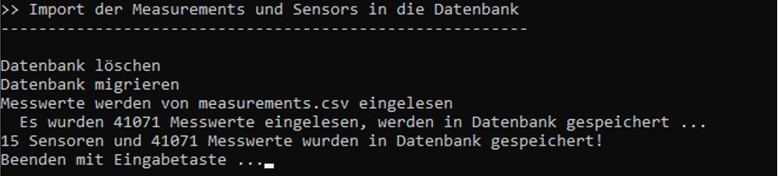
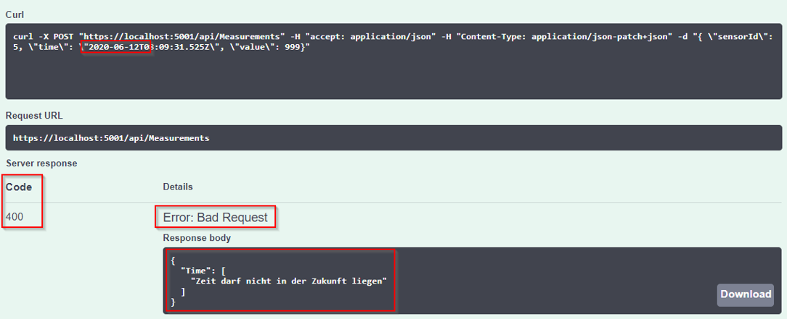

# SmartSchool (Razor Pages und WebApi)

# Lehrziele

* ASP.NET Core Razor Pages
* ASP.NET Core WebApi
* Entity Framework Core
* Unit of Work / Repositories
* Validierung

Es ist eine einfache Anwendung zu implementieren, die Sensoren und deren Messwerte mit einer Webanwendung verwaltet. Per REST können neue Messwerte eingefügt werden und verschiedene Abfragen an das System gestellt werden.

# Core

Die Entitätsklassen sind bereits angelegt. Auch die Annotationen zur Definition (inkl. der Migrationen) der Datenbank sind bereits implementiert.

Im Corelayer sind die Contracts für die Repositories bedarfsgerecht zu erweitern.

# Import / Persistence

Die einzelnen Zeilen der `csv`-Datei sind so zu verdichten, dass am Schluss eine Collection von `Measurements` mit ihren `Sensoren` zurückgegeben wird.

Die Migration wurde bereits angelegt und muss nur verwendet werden, wenn an den Entitätsklassen Änderungen vorgenommen werden:

* Persistence als StartupProject 
* `Add-Migration InitialMigration`
* `UpdateDatabase` mit Kontrolle, ob DB angelegt wurde
* Die Daten über die ImportConsole importieren.

Die `ConnectionStrings` wurden in den relevanten Projekten schon in der `appSettings.json` festgelegt.

Die Repositories müssen noch mit den fehlenden Methoden erweitert werden.

# ASP.NET Core Razor Pages (SmartSchool.Web)

Ergänzen Sie das Template um die entsprechenden Pages.

## Page "Index"

**Anforderungen:**

* Anzeige der Sensoren
    * Sortierung nach Name und Location
* Dritte Spalte enthält die Anzahl der Messungen für den Sensor
    * Nicht alle Messwerte aus der Datenbank laden!
* Der Name führt als Link zu einer Übersicht der Messwerte für den Sensor
* Der Link "Edit Sensor" verweist auf eine Bearbeitungsseite für den Sensor

## Page "Members/Edit"

**Anforderungen:**

* Funktionalität
   * Name, Unit und Location können geändert werden
* Validierungen 
   * Siehe nächste Überschrift 
   * Es sind entsprechende Fehlermeldungen beim fehlerhaften Feld auszugeben
* "Save" führt zur Überblicksseite des Sensors mit den letzten 20 Messungen
* "Back to List" führt wieder auf die Hauptseite

Nach dem Anlegen kontrollieren Sie das Ergebnis über die Hauptseite.

### Validierung

1. Name (Pflichtfeld)
1. Location (Pflichtfeld)

### Zusätzliche Validierung (Spezialistenaufgabe)

1. Es dürfen keine zwei Sensoren mit dem gleichen Namen und der gleichen Location existieren!

## Page "Sensors/List?id=7"

Diese Seite erreicht man über den Namenslink (1. Spalte) der Hauptseite.

Neben den Stammdaten des Sensors sind die letzten 20 Messwerte inklusive Zeit, Wert und Einheit auszugeben.

# ASP.NET WebApi (SmartSchool.Web)

Die API-Controller sind im dazu vorgesehenen Verzeichnis zu implementieren.

## Route `/api/measurements/id`

* Die Struktur der Daten entnehmen Sie dem Musterausdruck:

   

* Sollte die id nicht existieren, ist NotFound zurückzugeben 

   

## Route `/api/measurements/measurementat`

* Liefert für den Sensor den zu der Zeit gültigen Wert
* SensorId 5: `20.10.2018 13:00`

    

* SensorId 5: `20.10.2018 12:59:16`

    

* SensorId 5: `20.10.2018 12:59:17`

    

* SensorId 5: `20.10.2017 13:00`

    

## Post-Route `/api/measurements`

* Erzeugt für den Sensor einen neuen Messwert

    

    

* Zeit darf nicht in der Zukunft liegen

    

* Ungültige SensorId liefert `NotFound`

## Route `/api/sensors`

* Liefert die Sensornamen alphabetisch sortiert

    

## Route `/api/sensors/id`

* Liefert die Sensordaten (entsprechend Muster)

    

* Gibt es die id nicht, wird `NotFound` geliefert

    

## Route `/api/sensors/countofmeasurements`

* Liefert die Sensordaten (entsprechend Muster) und die Anzahl der Messungen je Sensor
* Sortiert nach Sensorname und Location
* Es sind möglichst wenige Daten von der Datenbank zu laden 
* Die Dauer der Abfrage ist zu optimieren

    

## Route `/api/sensors/averagevalues`

* Liefert die Sensordaten (entsprechend Muster) und den Durchschnitt der Messwerte je Sensor
* Sortiert nach Sensorname und Location
* Es sind möglichst wenige Daten von der Datenbank zu laden 
* Die Dauer der Abfrage ist zu optimieren

    

# Hinweise

* Beachten Sie, dass die Views zum Großteil angelegt sind. Sie sind teilweise auskommentiert, um die Anwendung kompilierbar zu halten!
* Verwenden Sie zum Sicherstellen der Datenkonsistenz (siehe Screenshots der Website) die notwendigen Validierungsattribute.
* Verwenden Sie dort wo sinnvoll `DataTransferObjects`.
* Achten Sie auf eine korrekte Schichtentrennung (Core, Persistence und Web).
* Verwenden Sie das `UnitOfWork`-Muster.
* `Dependency Injection (IoC)` verwenden. 
* Erweitern Sie, wo notwendig die Repositories

